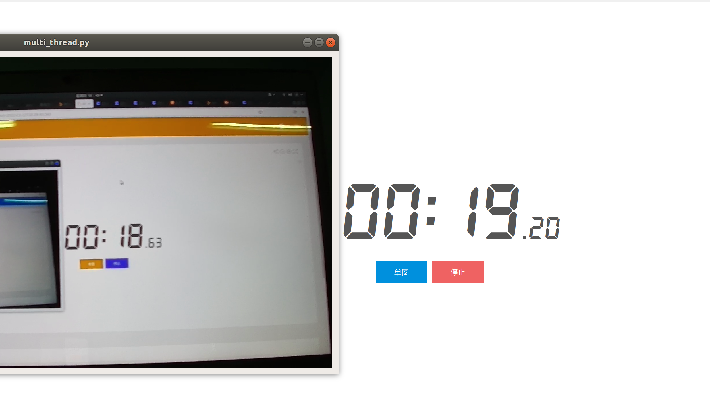

# RTSP网络相机实时显示

## 一、介绍

* 平台 Ubuntu / windows

* 依赖 opencv-python

需要对海康网络相机(`rtsp协议`)1080P相机拉流，低延迟地显示在QT客户端界面中，尝试了如下三种方案：

### **1.1、基于ROS节点通信(延迟高)**

由于python3中CVBRIDGE使用具有问题，因此使用`ir_rgb_remap`节这对点进行了数据格式sensor_msgs::Image->collect_data::self_image(自定义msg格式)转换[1]，再在客户端进行collect_data::self_image解码，显示在客户端中。该方法信息经过若干节点传递，延迟较高。

### **1.2、单线程cv2.VideoCapture(延迟高)**

使用timer作为触发信号，利用QT的信号-槽机制让控件更新图像。可以通过控制timer触发信号发送与否，随时开始，停止接收视频流，该方法对传输像素较小的视频流延迟较小，但对1080P图像仍延迟较高。

### **1.3、多线程cv2.VideoCapture(基本满足实时需求)**

线程A从通过RTSP协议从视频流中读取出每一帧，并放入队列中，线程B从队列中将图片取出，处理后进行显示[2]。线程A如果发现队列里有两张图片（证明线程B的读取速度跟不上线程A），那么线程A主动将队列里面的旧图片删掉，换上新图片，通过多线程的方法:

1. 线程A的读取速度始终不收线程B的影响，防止网络摄像头的缓存区爆满
2. 线程A更新了队列中的图片，使线程B始终读取到最新的画面，降低了延迟

**备注**:目前没找到让python线程停止(挂起)、再启动方法<[3]，**线程只能调用start函数一次**。采取先kill掉线程，再构造新的线程对象重新start来实现拉流停止、重启的效果。

## 二、demo

* 单线程(1.2)

`./single_thread.py`

* 多线程(1.3)

`./multi_thread.py`

## 三、效果

## 参考资料

[1] [用自定义数据类型解决cv_bridge问题](https://blog.csdn.net/lizhiyuanbest/article/details/108022588)

[2] [多线程RTSP网络相机实时显示](https://blog.csdn.net/ljx1400052550/article/details/106987943)

[3] [python threading中的thread开始和停止](https://blog.csdn.net/ygfrancois/article/details/85265955#commentBox)

